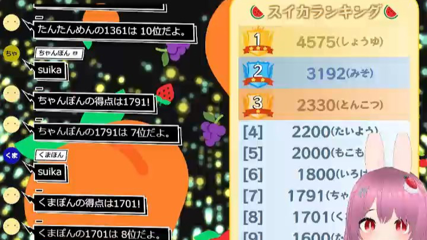

# スイカ 🍉 ジェネレーター Gousei Suika Generator

最終更新日：<% tp.date.now('YYYY/MM/DD') %>

 テンプレートです。

この内容は、BOOTH で配布している、 [スイカ 🍉 ジェネレーター Gousei Suika Generator](https://pintocuru.booth.pm/items/5813323) の readme となります。

## このテンプレートは何？（Features）

### コメントでスイカゲーム風のおみくじを楽しめる

- コメントに「スイカ」「スイカゲーム」「🍉」などを入力すると、配信画面にフルーツが降り、ランダムで得点が表示されます。
    - 得点は通常 900～3000 点程度ですが、まれに 5000 点を超える高得点も出現します。
    - 降ってくるフルーツは演出です。くっついても進化はしません。
- 得点は読み上げられ、スイカゲーム風のスコア表示で **誰がどんな得点か** がわかります。
- プレイしたくなる!スコアランキング付き
    - 何度でもプレイ可能で、デフォルトでは最高 5 回までの記録が残ります。
    - リスナーからコメントが増える効果も期待できます
        - 同じコメントが多くなる場合もあります💦

### PRO 版で遊べる追加ゲーム

- 「カボチャゲーム」：ハロウィン仕様のスイカゲーム風おみくじ
	- キャンディーとカボチャが高得点のカギ!「スイカゲーム」よりハイリスク・ハイリターンです。
- 「クジラゲーム」：クジラゲーム風のおみくじ
	- 得点は「スイカゲーム」「カボチャゲーム」よりハイリスク・ハイリターンに！最低記録も目標になっちゃう？

## つかいかた (Usage)

解説配信でも良く使われる、「ゆっくり霊夢」「ゆっくり魔理沙」を BOT キャラクターにしました。「おみくじ」BOT らしく " 博麗神社の巫女 " が、おみくじの結果を教えてくれます。

- **朝活配信**
	- 今日 1 日の運勢を占う「おみくじ」で、配信が賑やかに。
- **雑談配信**
	- リスナーのコメントに対してキャラクターがボケたりツッコミを入れたりして、自然に会話が広がります。
- **ゲーム配信**
	- ゲームに集中していても、BOT が代わりに挨拶してくれるので、初見さんを見逃しません。

## カスタマイズ（Customization）

- おみくじの内容は、配信スタイルに合わせて **自由にカスタマイズ** できます。
- ゲームの結果は「ゲームスクリプト」と呼ばれる特殊なプレースホルダー生成機能によって実現しています。
    - そのため、通常のおみくじとは異なる書き方になります。
    - 詳しくはプリセットデータに記載された実例をご参照ください。

## よくある質問 (FAQ)

### システム関連

### スイカゲーム関連

#### Q. 落ちてくるフルーツの数と得点が合わない

A: フルーツの落下は演出です。実際の得点計算とは異なります。

#### Q. 得点表示の前にランキングにその記録が表示されている

A: 現在の仕様です。ごめんなさい。うまく作れなかったんです💧

#### Q. 「スイカゲーム」の最低得点・最高得点は？

A: 最低値は理論上 560 点、最高は 9999 点以上です。ただし、天文学的な確率です。クジラゲームの最低値は、理論上 0 点です（その場合はマリモとシャチしか出ません）

#### Q. 占い機能ってもうないの？

A: ごめんなさい💦 旧版にあった占いは無料にしたので、よかったら使ってください。

#### Q. OBS のシーン移動でランキングがリセットされる

A: 現在の仕様です。シーン移動時にランキングは保持されません。

## クレジット（Credits）

- BOOTH 紹介画像のタイトルロゴのフォント
    提供元：ＫＦひま字ふで <https://www.kfstudio.net/font/kfhimajifude/>

## バージョン情報 (Version)

### ver.250816

- システムファイルを「[おみくじ BOT](../OmikujiBot/README.md)」に移しました。
- メインのシステムをおみくじ BOT に任せたことにより、バージョン表記の変更を行いました。
	- セマンティック・バージョニング > 日付にしました。
- 以降、おみくじ内容が変化しない限りは、バージョンの表記は変化しません。
- 以上の経緯により、ランキングの見た目が変化しました。
	- 画像を使わない見た目になりました。
	- ランキング告知の際、読み上げを行わず、代わりにトースト表記にしました。
	- トースト表記の際、わんコメに投稿しなくなったので、ジェネレーターではランキングのコメントが表示されなくなります。
- 新版のおみくじ BOT を公開したため、旧版はサポートを終了し、無料で提供しています。
	- 旧版に含まれていた「占い」機能については、新版には引き継いでいません。

### v0.31 : 24/07/17

- 無料版/支援版で機能の差を付けました。
    - カボチャゲーム/クジラゲームは支援版のみに変更。
    - 新規機能「フルーツ占い」を入れました。こちらも支援版に入ってます。
- userData.js を編集するタイプに変更。
- 以下の機能を削除
    - 特定のユーザーを弾く機能 (わんコメのブロック機能で弾けるので)
    - 隠しモード「イカゲーム」(イカゲーム機能で遊ぶ場合は v0.3 をご利用下さい)
- 内部コードの仕様変更 (Vue2 から Vue3 になってます)

### v0.3 : 24/07/02

- 「ウェルカムおみくじ」の追加
- 「カボチャゲーム」「クジラゲーム」を追加
- ギフト/スパチャした場合のみ「スイカ」が可能になるスイッチを追加
- 特定のユーザーを弾く設定を追加
- 他細かい調整・改良

### v0.2 : 24/06/10

- 演出の調整、アイコン等の編集を行いました (弾ける効果音など)
- 今回のスコア + ユーザー名を表示するようにしました
- 「スイカ」のおみくじができる最大回数を追加

### v0.1 : 24/06/08

- 初版

<%* await tp.user.expandEmbeds(tp) %>