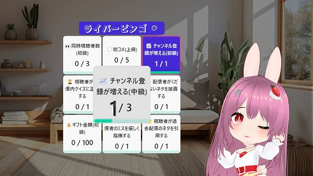
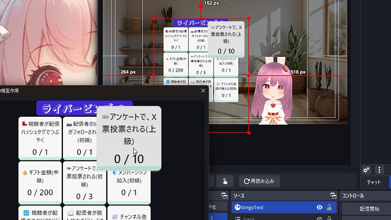
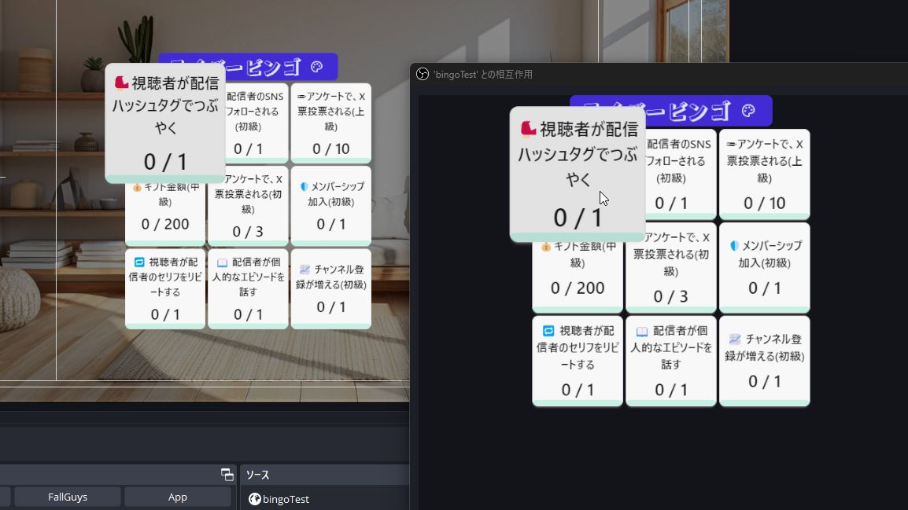
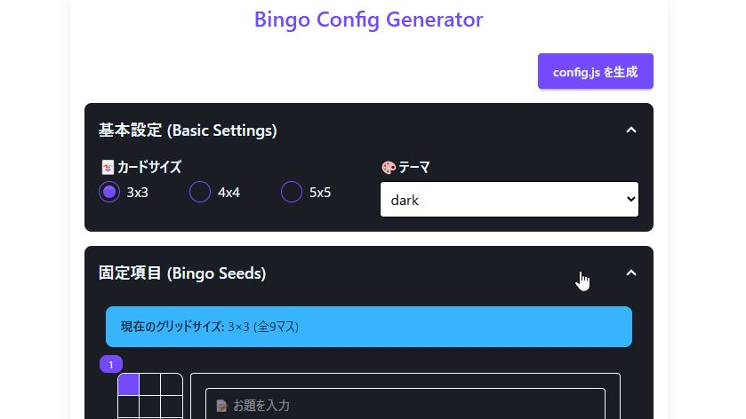

# ライバービンゴ LiverBingo

最終更新日：2025/08/18

OBS で使える、ライバー・配信者向けビンゴカードです。

この内容は、BOOTH で配布している、 [ライバービンゴ LiverBingo](https://pintocuru.booth.pm/items/6744044) の readme となります。

## はじめに（Intro）

- 本ソフトウェアの利用は自己責任でお願いいたします。
- 仕様は予告なく変更される場合があります。

## このビンゴカードでできること（Features）

### 🎬 雑談配信に！OBS で操作できるビンゴカード

- 【ライバービンゴ LiverBingo】は、OBS の「対話モード」で操作できる、ビンゴカードです。
- 起動時にランダム、または指定した内容のカードを表示させます。
- クリックすると、カウントが増え、規定数以上のカウントでマス目に色が付き、ビンゴを演出します。

### 💬 主な機能

1. 🎮 **OBS「対話モード」による直感的な操作性**
   - マウスひとつで、ビンゴのポイント増減が可能。
   - パネル変更やリセットも、ワンクリックで OK。
2. 🎨 **エディターによるテキスト・カラーの自由なカスタマイズ**
   - エディター付きで 編集しやすい。オリジナルビンゴカードを作成可能
   - DaisyUi による、35 種類のテーマカラーから選択可能。
3. ⏳ **配信に最適化された視認性の高いデザイン**
   - カーソルを合わせると選択マスが拡大表示され、視認性が向上
   - ビンゴ達成で、ラインの色が鮮やかに変化

## インストール方法 (Installation)

### Zip ファイルを解凍し、適切なフォルダに入れる

ダウンロードページから、テンプレートをダウンロードしてください。

1. ダウンロードした zip ファイルを解凍する
2. 後で参照しやすいよう、OBS 用フォルダやデスクトップなど分かりやすい場所に保存する

### テンプレートを OBS に挿入した後の追加設定

ブラウザソースのサイズを指定する際、追加で下記の設定を行ってください。

1. 以下の 2 つにチェックを入れる
   - ✅ 表示されていないときにソースをシャットダウンする
   - ✅ シーンがアクティブになったときにブラウザの表示を更新する

## つかいかた (Usage)

### ビンゴカードを操作する

OBS の「対話モード」を使い、ビンゴカードを操作します。

1. `index.html` のソースを右クリックし、「対話（操作）」を選択
2. ビンゴカードが表示されるので操作する

#### ビンゴカードの説明

- 🎯 マス目の操作
  - 左クリック：数字を 1 増やす
  - 右クリック：数字を 1 減らす
  - 数字が 0 の時に右クリック：マスの内容をランダムに変更
- 🔧 **テーマ設定**
  - テーマカラーを変更可能（設定は保存されません）
  - テーマカラーは [DaisyUi](https://daisyui.com/docs/themes/) を使用しています
- 🃏 **タイトル**
  - 右クリック：ビンゴカードをリセット

## カスタマイズ（Customization）

コンフィグエディター(`configMaker.html`) が同梱されており、簡単に自作のカードを作成できます。

### 編集を反映させる

1. 「config.js を生成」ボタンをクリック
2. 生成されたファイルを、`configMaker.html` と同じフォルダに上書き保存

### 主な設定項目

#### 基本設定 (Basic Settings)

- `🃏カードサイズ`: 3x3、4x4、5x5 から選択
- `🎨テーマ`: テーマカラーを変更

#### 固定項目 (Bingo Seeds)

各マスに入れるお題を個別に設定。

- `📝お題`: ビンゴカードの各マスに表示する目標
- `🎯達成目標`: 目標の達成に必要な回数、金額、人数など
- `📏単位`: 目標の単位。（例：10 人単位や、100 円単位など）

#### ランダム項目 (Bingo Random Seeds)

固定項目のお題が空白のマスに対して、ここからランダムに選択。

- `📝お題`: ビンゴカードの各マスに表示する目標
- `🎲出現割合`: 目標の出現確率。大きいほど出現しやすい。
- `🎯達成目標`: 目標の達成に必要な回数、金額、人数など
- `📏単位`: 目標の単位。（例：10 人単位や、100 円単位など）

## よくある質問 (FAQ)

### 導入関連

#### Q. OBS 以外の配信ソフトでも使えますか？

A: HTML を表示できる配信ソフトであれば使用可能です（Streamlabs、XSplit など）。

### ビンゴカード関連

#### Q. ビンゴの内容を変更するには？

A: configMaker.html という、設定を変更できるファイルを用意しています。この readme の カスタマイズ を参照して下さい。

## トラブルシューティング (Troubleshooting)

### ビンゴの表示関連

#### Q. 色が被って文字が見えづらい

A: テーマカラーによっては、色が被ってしまい、見づらい事があるかもしれません。

#### Q. 効果音が配信上で鳴らない

A: 「obs 音が出ない」 で検索してみて下さい。

## クレジット（Credits）

- すべての効果音
  提供元： [効果音ラボ](https://soundeffect-lab.info/)
- BOOTH 紹介画像のタイトルロゴのフォント
  提供元：[ガガガガ | ヤマナカデザインワークス](https://ymnk-design.com/12-2/)
- BOOTH 紹介画像の背景:
  提供元：[シンプルなワンルームの無料の AI 画像素材 - ID.36120 ｜フリー素材 ぱくたそ](https://www.pakutaso.com/20230809229oneroomDIS.html)

### 素材の取り扱いについて

- イラスト素材・動画・音源の再配布は禁止
- イラストや音源の利用については、各配布サイトの利用規約をご確認ください。

## バージョン情報 (Version)

### v0.1.2 (2025/08/18)

- ReadMe を変更しました

### v0.1.1 (2025/07/24)

- ReadMe を変更しました

### v0.1.0 (2025/03/28)

- 初期リリース

---

作成者：せすじピンとしてます @pintocuru

[Twitter](https://twitter.com/pintocuru) | [YouTube](https://www.youtube.com/@pintocuru)
