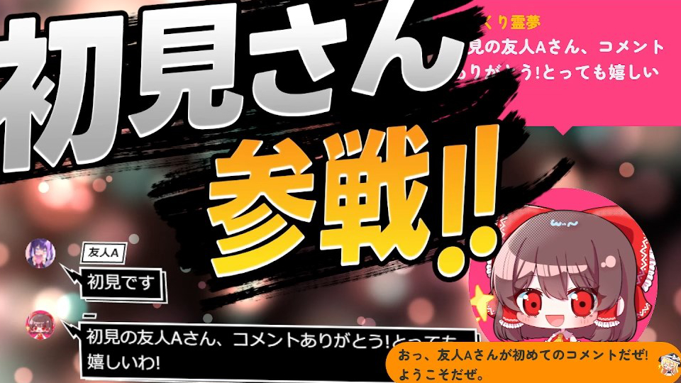

# おみくじ BOT 用 WordParty

最終更新日：2025/08/10

配信者のためのコメントアプリ「わんコメ」で使用できる、プラグイン です。

この内容は、BOOTH で配布している、 [おみくじBOT用WordParty](https://pintocuru.booth.pm/items/6048048) の readme となります。

## はじめに

- [わんコメ](https://onecomme.com/) の機能を前提としたアプリです。
- 本ソフトウェアの利用は自己責任でお願いいたします。
- 仕様は予告なく変更される場合があります。

## 1.この WordParty ってなに？

### 🎯1-1.ピンとくる企画で制作した「おみくじ BOT」と一緒に使う、WordParty です

以下のプラグインと一緒に使います。

- [初見判定ちゃん ゆっくり霊夢&ゆっくり魔理沙 First Counter reimu & marisa](https://pintocuru.booth.pm/items/5471598)
	- v0.8 まで対応。v0.7 までのものは内容が異なるため、正常に機能しない可能性があります。
- [スイカ🍉ジェネレーター Gousei Suika Generator + フルーツ占い](https://pintocuru.booth.pm/items/5813323)
	- v0.4 まで対応。v0.31 以前のものは内容が異なるため、正常に機能しない可能性があります。

おみくじ BOT プラグイン OmikenPlugin は、わんコメに BOT 機能を付与し、配信者とリスナーの双方向コミュニケーションを促進します。おみくじのランダム自動返信や、コメントによるミニゲーム機能を提供し、より魅力的な配信体験を実現します。

### ✨ 1-2.WordParty って何かしら？

- わんコメを通じて、主にコメントにあるワードをきっかけに演出を表示できます。
- おみくじ BOT では、この演出を任意に起動し、演出として盛り上げます。
- OBS への導入方法など、詳細は [コメントによる演出 - WordParty](https://onecomme.com/docs/feature/wordparty) を御覧ください。

## 2.導入方法

テンプレートの導入は、[テンプレートの導入方法](../install/readme_install.md) の、「1-B. わんコメと連携する場合の導入方法」を御覧ください。

## 3.よくある質問

わんコメの機能については [よくある質問](https://onecomme.com/docs/faq) または [導入ガイド](https://onecomme.com/docs/guide) をご参照ください。

## 4.クレジット：イラストと音源について

### 🎵 効果音・BGM

- **さまざまな効果音**
  [効果音ラボ](https://soundeffect-lab.info/)

- **ボンバースロット：ジングル**
  [red bears (rock OP1) - Nakano Sound](https://www.nakano-sound.com/free/rock.html)

- **うさぎスロット：ジングル**
  [ミュージックノート - distress（加工して使用）](https://www.music-note.jp/bgm/short.html)

- **かけざんスロット：ジングル**
  [ガレトコ - Let's Battle](https://garetoco.com/material/2/)

- **パルプンテ：効果音**
  [イワシロ音楽素材 - ほがほが](https://iwashiro-sounds.work/bgm/iwashiro_se2/)

- **ドラちゃん：波音リツの音声**
  [本格的 ガチムチパンツレスリング](https://www.nicovideo.jp/watch/sm1175788)

### 🎨 イラスト・グラフィック

- **ゆびをふるの指**
- **ボンバースロットのフルーツ
- **ドラちゃんの背景の集中線**
- **桃鉄カードの顔**
- **あとなんか色々**
  [ダーヤマ TOPECONHEROES](https://twitter.com/topeconheroes)

- **ボンバースロット / うさぎスロット：爆発アニメーション**
  [ニコニ・コモンズ：爆発して画面を覆う炎（フルHD）](https://commons.nicovideo.jp/works/nc121868)

- **じゃんけん（グーチョキパーのイラスト）**
  [ツカッテ - じゃんけんプレート](https://tsukatte.com/rock-paper-scissors_plate/)

- **ボンバースロット：ガム（BAR シンボル）**
  [イラストくん - 板ガムのイラスト](https://illustkun.com/07358-20230417-b/)

- **スイカゲーム：クジラモードのクジラたち**
  [いらすとや - マッコウクジラのイラスト](https://www.irasutoya.com/2013/07/blog-post_6885.html)

### 🎁 ゆっくり霊夢・魔理沙用：ギフト素材

- [ツカッテ - 賽銭箱のイラスト](https://tsukatte.com/saisenbako/)
- [ツカッテ - みずたまキノコのイラスト](https://tsukatte.com/mushroom-polka-dots/)

### 🤖 その他

- **うさぎスロット：うさぎ（生成系）**
  [ChatGPT](https://chatgpt.com/)

- **じゃんけん：YouWin/YouLose**
- **初見さん参戦**
- **初見なのにモデレーターさん参戦**
- **挑戦者が現れました**
  せすじピンとしてます (自作)

### 素材の取り扱いについて

- イラスト素材・動画・音源の再配布は禁止 (せすじピンとしてます作製のものも含む)
- イラストや音源の利用については、各配布サイトの利用規約をご確認ください。

## バージョン情報

### 25/08/10

- 「ドラちゃん」に一部素材追加
- 更新日付を意識したわけではない。仕方ないね。

### 25/07/24

- ReadMe の一部編集

### 25/07/15

- うさぎスロット、かけざんスロット　の素材を追加
- 内部ファイルの移動や、容量削減を行ってます。

### 24/08/28

- 「初見判定ちゃん」と分離した初版をリリース

---

作成者：せすじピンとしてます @pintocuru

[Twitter](https://twitter.com/pintocuru) | [YouTube](https://www.youtube.com/@pintocuru)
