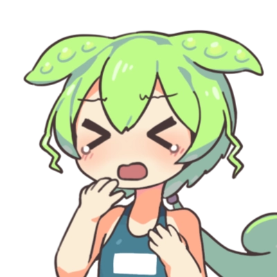

# おみくじ BOT みんなのずんだもん OmikujiBot EveryoneZunda

最終更新日：<% tp.date.now('YYYY/MM/DD') %>

  テンプレートです。

 [おみくじ BOT みんなのずんだもん OmikujiBot EveryoneZunda](https://pintocuru.booth.pm/items/6053855)

## 1.このテンプレートは何？

### ずんだもんがリスナーを歓迎してくれるジェネレーター

- わんコメに BOT 機能を付与するジェネレーター【おみくじ BOT】を使った、ずんだもんが懸命に頑張るテンプレートです。
- イラストは 坂本アヒル さんのを使用してます。

### ずんだもん のキャラクター設定

このジェネレーターでは、ずんだもんを以下のようなキャラクターとして登場させています。

- 誰に対しても素直に喜び、ちょっとまごつきながらも、歓迎してくれる
- しかし、初見詐欺に対しては、妙に煽り気味で上から目線（のように見える）
- 何故か芸人ネタを持ち込む。[世界的な大スター](https://ja.wikipedia.org/wiki/%E3%81%A8%E3%81%AB%E3%81%8B%E3%81%8F%E6%98%8E%E3%82%8B%E3%81%84%E5%AE%89%E6%9D%91) が好きなようだ。

- 原作では「プライドの高い不幸キャラ」なのですが、おみくじ BOT のずんだもんは他人への思いやりが強かったり、不幸さが薄いかもしれません。ずんだもち 1 個贈呈なのだ。

## インストール方法

## つかいかた

解説配信でも良く使われる、「ゆっくり霊夢」「ゆっくり魔理沙」を BOT キャラクターにしました。「おみくじ」BOT らしく " 博麗神社の巫女 " が、おみくじの結果を教えてくれます。

- **朝活配信**
	- 今日 1 日の運勢を占う「おみくじ」で、配信が賑やかに。
- **雑談配信**
	- リスナーのコメントに対してキャラクターがボケたりツッコミを入れたりして、自然に会話が広がります。
- **ゲーム配信**
	- ゲームに集中していても、BOT が代わりに挨拶してくれるので、初見さんを見逃しません。

## カスタマイズ

(../../template/customization/customization_11.md)

## クレジット：イラストと音源について

- **ずんだもん ずんだもん立ち絵素材 - 坂本アヒルのイラスト - pixiv**[https://www.pixiv.net/artworks/92641351](https://www.pixiv.net/artworks/92641351)

### 素材の取り扱いについて

- イラスト素材・動画・音源の再配布は禁止
- イラストの利用については、公式の規約の範囲なら何に使ってもだいじょうぶ！（ず・ω・きょ）

どうしてこんな格好をさせるのだ！ひどい仕打ちなのだ！

## バージョン情報

### ver.250816

- 「[おみくじ BOT](../OmikujiBot/README.md)」のバージョンアップに伴い、内容をリニューアルしました。
	- じゃんけんでは「僕」と言い換えています。

### ver.240830

- 「初見判定ちゃん ずんだもん」としてリリース。

<%* await tp.user.expandEmbeds(tp) %>